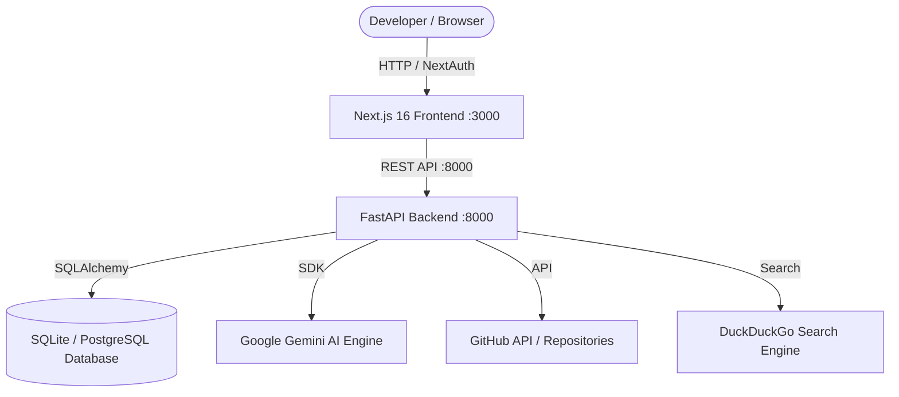

# AI Engineering Copilot 🚀

> An autonomous, full-stack AI Copilot platform built for engineering teams, code intelligence, repository telemetry, and multi-agent developer workflows.

---

## 🌟 Key Features

- **🤖 Autonomous AI Code Assistant**: Powered by **Google Gemini AI** with live context-aware chat, code explanation, debugging, refactoring, and automated PR reviews.
- **🌐 Web & Repository Search**: Live web research via **DuckDuckGo Search** and GitHub repository inspection via **PyGithub**.
- **💻 Modern Developer Workspace**: Built with **Next.js 16**, **React 19**, **Tailwind CSS**, dynamic dark/light theme switching, code viewers, and interactive terminal interfaces.
- **🔐 Authentication & SSO**: Configured with **NextAuth.js** supporting Google OAuth, GitHub SSO, Enterprise SAML/Okta, and local workspace sign-in.
- **💾 Persistent History**: SQLAlchemy database backend with SQLite / PostgreSQL support for chat session history and message records.
- **📖 Interactive API Documentation**: Built-in FastAPI Swagger UI (`/docs`) and Next.js OpenAPI explorer (`/api-doc`).
- **🐳 Containerization Ready**: Complete Docker and Docker Compose configurations for instant dev and production deployment.

---

## 🛠️ Tech Stack

### Frontend

- **Framework**: [Next.js 16](https://nextjs.org/) (App Router, Turbopack)
- **UI & Styling**: [React 19](https://react.dev/), [Tailwind CSS](https://tailwindcss.com/), [Lucide React](https://lucide.dev/)
- **Auth**: [NextAuth.js v4](https://next-auth.js.org/)
- **API Docs**: Swagger UI React & next-swagger-doc

### Backend

- **Framework**: [FastAPI](https://fastapi.tiangolo.com/) (Python 3.10+)
- **AI Engine**: [Google GenAI SDK](https://github.com/google/generative-ai-python) (`gemini-2.5-flash`)
- **Database & ORM**: [SQLAlchemy 2.0](https://www.sqlalchemy.org/) (SQLite / PostgreSQL)
- **Integrations**: [PyGithub](https://github.com/PyGithub/PyGithub), DuckDuckGo Search API, Uvicorn

---

## 📐 Architecture Overview



---

## 🚀 Getting Started

### Prerequisites

- **Node.js**: `v18+` or `v20+`
- **Python**: `3.10+`
- **Package Managers**: `npm` / `pnpm` and `pip`
- _(Optional)_ **Docker** & **Docker Compose**

---

### 1. Clone the Repository

```bash
git clone https://github.com/sarathhh25/AI-Engineering-Assistant.git
cd AI-Engineering-Assistant
```

---

### 2. Configure Environment Variables

Copy the example environment file and add your credentials:

```bash
cp .env.example .env
cp .env.example Frontend/.env.local
```

Edit `.env` (or `Frontend/.env.local`):

```env
# Gemini AI API Key (Get from: https://aistudio.google.com/)
GEMINI_API_KEY=your_gemini_api_key_here

# GitHub Personal Access Token (for repo inspection & telemetry)
GITHUB_TOKEN=your_github_personal_access_token_here

# Frontend API Connection URL
NEXT_PUBLIC_API_URL=http://localhost:8000

# NextAuth / OAuth Configuration
NEXTAUTH_URL=http://localhost:3000
# Generate a secure secret using: openssl rand -base64 32
NEXTAUTH_SECRET=your_generated_secret_key_here
GOOGLE_CLIENT_ID=your_google_client_id_here.apps.googleusercontent.com
GOOGLE_CLIENT_SECRET=your_google_client_secret_here

# Database URL (Required)
DATABASE_URL=postgresql://postgres:<password>@localhost:5432/ai_copilot_db
```

---

### 3. Install Dependencies

#### Backend

```bash
pip install -r requirements.txt
```

#### Frontend

```bash
cd Frontend
npm install
cd ..
```

---

### 4. Running Locally

#### Run Both Frontend & Backend Concurrently (Recommended)

From the project root:

```bash
npm run dev
```

#### Or Run Independently:

- **Backend**:
  ```bash
  python -m uvicorn Backend.main:app --reload --port 8000
  ```
- **Frontend**:
  ```bash
  cd Frontend
  npm run dev
  ```

Access the applications:

- **Frontend UI**: [http://localhost:3000](http://localhost:3000)
- **Backend API Root**: [http://localhost:8000](http://localhost:8000)
- **Backend Interactive Swagger Docs**: [http://localhost:8000/docs](http://localhost:8000/docs)
- **Frontend API Docs**: [http://localhost:3000/api-doc](http://localhost:3000/api-doc)

---

## 🐳 Docker Deployment

To launch the full stack with Docker Compose:

```bash
# Build and start services in background
docker compose up -d --build

# View logs
docker compose logs -f

# Shut down
docker compose down
```

---

## 📂 Project Structure

```text
AI-Engineering-Assistant/
├── Backend/
│   ├── database.py         # SQLAlchemy engine, session maker & message models
│   ├── main.py             # FastAPI entrypoint, AI & GitHub endpoints
├── Frontend/
│   ├── app/
│   │   ├── api/            # Next.js API routes (NextAuth, Chat proxy, Health)
│   │   ├── api-doc/        # Swagger API documentation viewer
│   │   ├── dashboard/      # Developer metrics, project health & insights
│   │   ├── login/          # Auth page with OAuth & SSO
│   │   ├── globals.css     # Global theme & typography styles
│   │   ├── layout.tsx      # Root application layout
│   │   └── page.tsx        # Landing / routing redirect
│   ├── components/
│   │   ├── agents/         # AI Agent workflow & execution components
│   │   ├── auth/           # Login & SSO form interfaces
│   │   ├── chat/           # Chat workspace, code blocks & prompt suggestions
│   │   ├── dashboard/      # Metrics, repository cards & analytics
│   │   ├── integrations/   # GitHub, Jira, CI/CD integrations page
│   │   ├── repository/     # File tree explorer, code viewer & diff viewer
│   │   └── top-nav/        # Global command palette, repo selector & user menu
│   ├── lib/                # API client, swagger & integration utilities
│   ├── package.json        # Frontend dependencies
│   └── Dockerfile          # Next.js container configuration
├── .env.example            # Sample environment variables
├── copilot_db.db           # SQLite database for local history
├── docker-compose.yml      # Multi-container orchestration
├── package.json            # Root workspace scripts
├── requirements.txt        # Python backend dependencies
└── README.md               # Project documentation
```

---

## 🧪 Available Scripts

| Command                | Description                                                  |
| :--------------------- | :----------------------------------------------------------- |
| `npm run dev`          | Start both Next.js frontend and FastAPI backend concurrently |
| `npm run dev:frontend` | Start Next.js frontend in development mode (`:3000`)         |
| `npm run dev:backend`  | Start FastAPI backend with hot-reloading (`:8000`)           |
| `npm run build`        | Build the Next.js production bundle                          |
| `npm run test:e2e`     | Run Playwright end-to-end test suite                         |
| `npm run lint`         | Run Next.js ESLint checks                                    |

---

## 🤝 Contributing

1. Fork the repository
2. Create a feature branch: `git checkout -b feat/your-feature-name`
3. Commit your changes: `git commit -m 'feat: add exciting new capability'`
4. Push to the branch: `git push origin feat/your-feature-name`
5. Open a Pull Request

---

## 📄 License

This project is licensed under the [MIT License](LICENSE).
